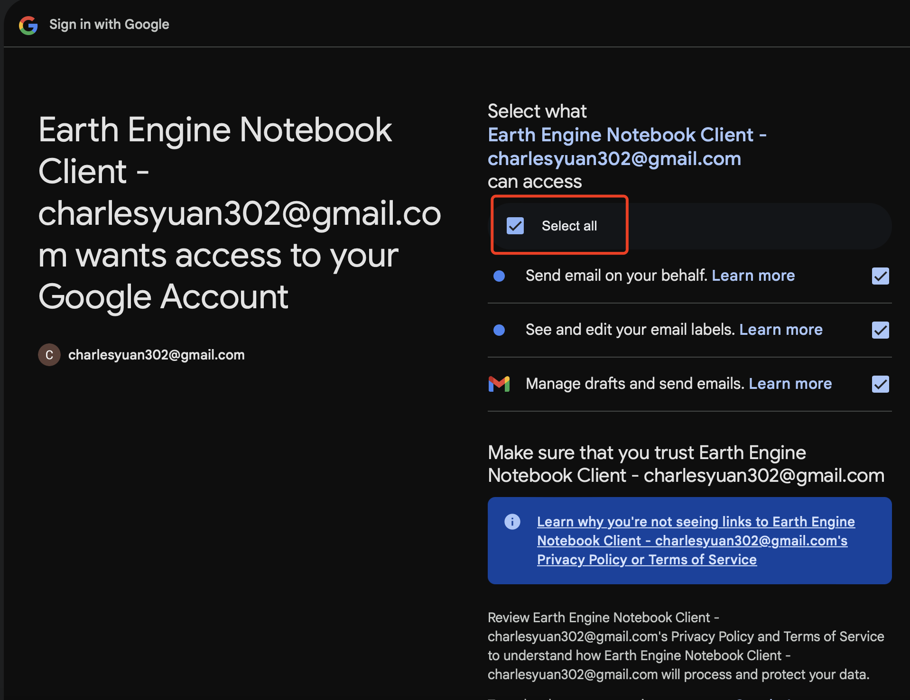

# Airtable Computer Use Project

Airtable Computer Use project enables LLM (e.g. Claude) to interact with Airtable databases, Gmail, etc. through their API. In this project, we will use natural language to query the data in the Airtable table,  generate insight report about the data, and send the report to the email address specified in the tool call.

## Overview

The Airtable Computer Use project extends the base Computer Use functionality with Airtable and Gmail SDK integration, allowing LLM (e.g. Claude) to:
- List records from Airtable tables
- Create, update, and delete records in Airtable tables
- Logic operations on Airtable records
- Create new tables and fields in Airtable using metadata tool
- Send email with Airtable data using Gmail tool

## Components

### AirtableTool

The core components are the `AirtableRecordTool`, `AirtableSchemaTool`, and `AirtableFormulaTool` classes which provide a clean interface for Airtable operations:

- **Authentication**: Uses `AIRTABLE_API_KEY` environment variable
- **URL Parsing**: Automatically extracts base and table IDs from Airtable URLs
- **Error Handling**: Provides clear error messages for common issues

### GmailTool

The Gmail integration component allows sending analyzed Airtable data via email:

- **Authentication**: Uses OAuth 2.0 with credentials.json and token.json
- **Scopes**: Requires "https://www.googleapis.com/auth/gmail.send" scope
- **Error Handling**: Provides clear error messages for email sending issues

### Configuration

1. **Gmail Setup**: [Official Google Gmail API Quickstart](https://developers.google.com/gmail/api/quickstart/python)
   1. Go to [Google Cloud Console](https://console.cloud.google.com/)
   2. Create a new project or select an existing one
   3. Enable Gmail API:
      - Navigate to "APIs & Services" > "Library"
      - Search for "Gmail API"
      - Click "Enable"
   4. Configure OAuth consent screen:
      - Go to "APIs & Services" > "OAuth consent screen"
      - Fill in required app information:
        - App name (e.g., "Airtable Computer Use")
        - User support email (e.g., "support@example.com")
        - Developer contact information (e.g., "John Doe <john.doe@example.com>")
        -  Click "Next" and select "External" user type
      - On "APIs & Services" > "OAuth consent screen" > "Data Access": Add the scope: `https://www.googleapis.com/auth/gmail.send`
      - On "APIs & Services" > "OAuth consent screen" > "Audience": Add test users (your email addresses that will use the application)
   5. Create OAuth 2.0 Client ID:
      - Go to "APIs & Services" > "Credentials"
      - Click "Create Credentials" > "OAuth client ID"
      - Select "Desktop application" as application type
      - Give it a name (e.g., "Airtable Computer Use")
      - Click "Create"
      - Download the client configuration file (it will be named `client_secret_XXXX.json`)
      - Rename it to `credentials.json`
      - Move `credentials.json` to the root directory of the repo `~/enterprise_computer_use/credentials.json`
   6. Generate the token by running the authentication script:
   ```bash
   pip install --upgrade google-api-python-client google-auth-httplib2 google-auth-oauthlib
   python3 docs/project/airtable/generate_gmail_config.py
   ```
   See [generate_gmail_config.py](airtable/generate_gmail_config.py) for the authentication script details.

   
   Note: When you first run the application, it will open a browser window asking you to authorize
   the application. Sign in with your Google account and grant the requested permissions. Make sure to click "Select all" to grant the application access to your Gmail. This will
   generate the `token.json` file automatically.

   7. (Optional) Verify the token works by sending a test email:
   ```bash
   python3 docs/project/airtable/verify_gmail_config.py
   ```
   See [verify_gmail_config.py](airtable/verify_gmail_config.py) for the test script details.

   You have to modify the `TO_EMAIL`, `FROM_EMAIL`, `SUBJECT`, and `CONTENT` in the script to test if the email is sent successfully. This will attempt to send a test email using your credentials. If successful, you'll see a message ID printed in the console. Then you can check your email to see if the test email is received.

2. **Tool Registration**:
   The project registers the following tools:
   - `GmailTool` for email sending
   - `BashTool` for system commands
   - `AirtableRecordTool` for Airtable record operations
   - `AirtableSchemaTool` for Airtable metadata operations
   - `AirtableFormulaTool` for Airtable formula operations

Note: If you don't have an Airtable API key, you can get it following this instruction: https://chatgpt.com/share/67ac8396-cfa0-8013-828e-22ae2ddb518b


## Launch the application

To run the Airtable Computer Use app, you need to have the following environment variables set:

```bash
export ANTHROPIC_API_KEY=your_anthropic_api_key
export AIRTABLE_API_KEY=your_airtable_api_key
export OS=linux
export PROJECT=airtable_computer_use
```

Then run the app in the terminal (in the root directory of the repo):
```bash
./scripts/launch_linux_airtable_computer_use.sh
```
This Docker launch script sets up and runs the Airtable Computer Use application in a container, with an optional step to build the image locally. It configures necessary environment variables (like API keys) and mounts several important volumes including application code and credentials. The script exposes multiple ports for various services and runs in interactive mode, making the containerized application fully accessible.
